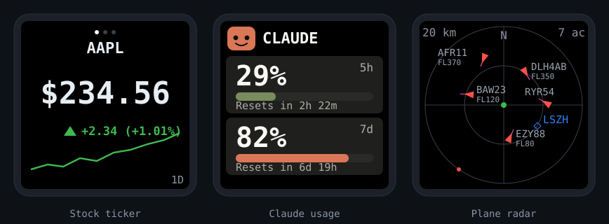
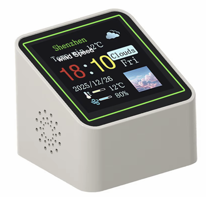
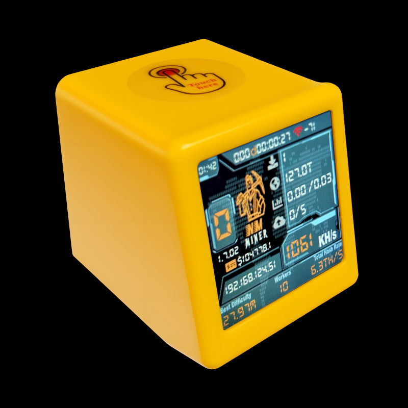

<p align="center">
  
</p>

<h1 align="center">smalltv-mod</h1>

> **Fork note:** this fork ([`kittipitch/smalltv-mod`](https://github.com/kittipitch/smalltv-mod))
> adds, on top of upstream `giovi321/smalltv-mod`:
> - A **Claude Code usage** mode (5h/7d quota, animated mascot, configurable
>   bar-fill direction)
> - **z.ai, Codex CLI, and Google Antigravity CLI** quota pages (each with its
>   own real logo and a two-card layout: quota % + reset/expiry countdown)
> - An **Agenda + Weather/AQI** mode (Google Calendar events — up to 6, split
>   across two rotating pages, color-coded per source calendar, multi-day
>   events shown as a compact date range ("Aug 10-11") instead of looking
>   like a same-day event — current weather/rain%/condition, 6-band AQI +
>   PM2.5, city name)
> - **Plane radar**, live (not disabled — see below), and it now falls back to
>   the weather-location setting if its own home lat/lon isn't set, so you
>   don't have to enter your location twice
> - **User-configurable carousel rotation order** — drag modes into whatever
>   order you want in the web UI, not just on/off checkboxes
> - **Device write-auth** — an optional secret key gating config/firmware/data
>   writes (including every quota-page push), so other devices on your LAN
>   can't overwrite the screen
> - **Display color correction** — per-channel R/G/B gain + saturation sliders
> - All fed by a companion daemon ([`clawdmeter-daemon`](https://github.com/kittipitch/clawdmeter-daemon))
>   that pushes usage/calendar/weather/z.ai/Codex/Antigravity data over WiFi —
>   the device itself never calls any of those APIs directly.
>
> Start with **[CLAUDE-USAGE-GUIDE.md](CLAUDE-USAGE-GUIDE.md)** for the full
> setup walkthrough (flashing, WiFi setup, daemon install, optional
> calendar/weather/secret-key setup).

<p align="center">
  <a href="https://github.com/kittipitch/smalltv-mod/actions/workflows/build.yml"></a>
  <a href="https://github.com/kittipitch/smalltv-mod/actions/workflows/docs.yml"></a>
  <a href="LICENSE"></a>
  
</p>

<p align="center">
  <a href="https://kittipitch.github.io/smalltv-mod/"></a>
</p>

> Not affiliated with GeekMagic or Anthropic. This firmware replaces the stock firmware entirely.

The GeekMagic SmallTV is a cheap desk gadget: a little cube with a 1.54" colour screen, an ESP inside, and a USB-C port. This firmware throws away the stock apps and turns it into things you actually watch: a **stock and crypto ticker** with prices, change, and a sparkline; a **Claude usage meter** with an animated mascot and your 5-hour and 7-day usage bars, plus matching quota pages for **z.ai, Codex CLI, and Google Antigravity CLI**; a **live plane radar** centred on your location, pulled from a free public feed; and an **agenda + weather/AQI** view fed from Google Calendar and a weather API. See [What it does](#what-it-does) for the full list. One image carries everything you enable; you switch between them (or rotate a carousel) in a built-in web UI, and you update over WiFi.

This firmware builds for four boards from one codebase. The original SmallTV runs an **ESP8266**; the **SmallTV-ultra** is the same ESP-12F hardware and screen, but its stock "Ultra" firmware and flash partitions block a normal OTA of this image, so it takes a two-step loader install (see [Flashing](#flashing)); a second version sold under the same "smart weather clock" look uses an **ESP32-C2 (ESP8684)** instead. A third build targets the **NMMiner NM-TV-154** (PCB marked "NM-TV-Miner"), a classic-ESP32 BTC lottery miner in the same cube with the same screen, confirmed working by a community tester in [issue #1](https://github.com/giovi321/smalltv-mod/issues/1). Pick yours below.

<p align="center">
  
</p>

## Which one do I have

Check the board before you build, because the variants flash differently.

| | SmallTV (ESP8266) | SmallTV-ultra | SmallTV (ESP32-C2) | NM-TV-154 (ESP32) |
|---|---|---|---|---|
| Photo |  |  |  |  |
| MCU | ESP-12F (ESP8266), 4 MB flash | same ESP-12F (ESP8266), 4 MB flash | ESP32-C2 / ESP8684, 4 MB flash | ESP32-WROOM-32E, 4 MB flash |
| Build env | `smalltv` | `smalltv_slim` for OTA install (`smalltv` fits fine over USB) | `smalltv_c2` | `smalltv_esp32` |
| Display | 1.54" 240×240 IPS ST7789 | same panel | same panel, RGB order | same panel |
| Flashing | OTA from the stock web UI, or UART header | two-step [loader](#flashing) then OTA, or UART | USB-C via the onboard CH340C (esptool) | USB via esptool |
| Tell-tale | ESP8266 module, no USB-serial chip | stock firmware branded "Ultra", OTA of this image fails with "Not Enough Space" | CH340C chip next to the USB-C port | PCB reads "NM-TV-Miner" |

The screens in the photos above are each unit's **stock firmware**, not this one, and they differ by model and firmware version (the ultra ships as a weather clock, the original as a ticker, and so on). Use the on-screen look as a first clue to which model you are holding, then confirm with the tell-tale row, because the binary and the install method differ per model. If your board has a **CH340C** chip beside the USB-C port and the main chip reads **ESP8684**, you have the ESP32-C2 model. Full teardown photos and pin maps are in [Hardware and variants](https://kittipitch.github.io/smalltv-mod/getting-started/hardware/).

### ⚠ "Pro" means two different devices

Two unrelated products are sold as "Pro", and they do not share a chip. Picking the wrong one means flashing an ESP32 image onto an ESP8266 or vice versa.

| | GeekMagic **SmallTV Pro** | vendor **SD PRO** (JUZIPi-tech) |
|---|---|---|
| Chip | classic **ESP32**, 8 MB flash | **ESP8266**, 4 MB |
| Build env | `smalltv_esp32_8mb` | **`smalltv_sdpro_slim`** |
| Tell-tale | touch button on top | stock reports `SD EN V1.x` at `/version` |
| Stock OTA route | `/update` | `/update_ota`, field `update` |

Confirm the chip from the vendor's own image rather than from the word on the box — see below. A GeekMagic SmallTV Pro image carries an ESP32 header; an SD PRO one contains the literal string `Firmware ONLY supports ESP8266!!!`.

Note this fork builds five physical targets (ESP8266, SmallTV-ultra, ESP32-C2, NM-TV-154, and SD PRO) and does not yet include the `smalltv_esp32_8mb` (GeekMagic SmallTV Pro) env that upstream added. If you have that device, build from upstream.

### Vendor rebrands of the same cube

The four above are the models this firmware is known to run on. The same cube is also resold under other vendors' own firmware, and those units are **not** covered by the table — they differ in which OTA route their stock web UI exposes, not usually in the hardware. If your unit's stock UI is titled "Smart Weather Clock" but none of the tell-tales above fit, identify it before flashing anything:

- **Read the version endpoint.** `curl http://<device-ip>/version`. A string like `SD EN V1.1.7` means the vendor "SD PRO" firmware (JUZIPi-tech), not GeekMagic.
- **Find the real OTA route.** `/update` may 404 while an OTA panel still exists in the UI. Read the page's JavaScript for the actual endpoint and form field name — SD PRO uses `POST /update_ota` with the field named `update`, where the original SmallTV uses `POST /update`.
- **Confirm the MCU from the vendor's own image, not from the case.** Vendors usually publish their firmware; the first 32 bytes settle it. An entry point of `0x4010****` with `0x3fff****` segments is an ESP8266, so the `smalltv` env applies. An ESP32 or ESP32-C2 image looks different.
- **Keep the vendor image.** Most vendors do not publish every version they ship, and there is no way to dump the running image over HTTP, so your restore path may be a downgrade. Get it before you overwrite anything.

> **Now tested, and there is one way to destroy the device — read this first.**
> SD PRO is a supported target: build `smalltv_sdpro_slim` (4M2M layout,
> `-D SDPRO_CS_GND` so GPIO15 is left alone, and the ticker/radar/TLS compiled
> out to fit). What is *not* safe is its stock updater. **It performs no
> free-space check: hand it an image bigger than the room it has and it replies
> `HTTP 200 OK`, writes past the end, and the unit never boots again** — dark
> screen, no WiFi, no AP, unaffected by a power cycle. Two units were lost that
> way. The `OK` only means the upload arrived; it never means it fit. Because
> this board has **no USB-serial chip** (USB-C is power only), there is no
> recovery over the network afterwards — only the internal UART pads.
>
> So install in two hops, never the full image directly:
> `smalltv-mod-loader.bin` (315,920 B) to `POST /update_ota` field `update`,
> then `smalltv-mod-firmware-sdpro.bin` (~579 KB) to the loader's
> `POST /update` field `firmware`. Between the two the screen is dark and the
> device leaves the network — that is the loader working, not a brick; it
> answers `200` on `/update` and `404` on `/`. Full walkthrough in
> [Flashing](https://kittipitch.github.io/smalltv-mod/getting-started/flashing/).

## What it does

- **Stock and crypto ticker.** Price, absolute change, percent change with an up/down arrow, and a sparkline. Up to 8 symbols rotate on a timer. Data comes straight from Yahoo Finance over HTTPS with no backend, from cash.ch for Swiss instruments Yahoo doesn't carry (structured products, AMCs, tracker certificates), or from your own webhook if you want to own the source. Stocks, ETFs, Swiss equities (`NESN.SW`), crypto (`BTC-USD`), and FX (`EURUSD=X`) all work. Add a quantity and cost basis to any ticker and it shows your P/L, with a portfolio summary page in the rotation.
- **Claude usage meter.** An animated pixel mascot plus your 5-hour and 7-day usage as big percentages with fill bars and reset countdowns. It is fed over WiFi by the [clawdmeter-daemon](https://github.com/kittipitch/clawdmeter-daemon) on your PC. When the data stops, the mascot plays an idle animation until it comes back. Running several devices, the daemon discovers them over mDNS and pushes to all of them.
- **Plane radar.** A scope centred on your location with nearby aircraft as heading triangles, speed vectors, and callsign or altitude labels, from the free [adsb.fi](https://adsb.fi) API or a LAN webhook. Marker size, an altitude filter, and label decluttering are configurable.
- **z.ai, Codex CLI, and Google Antigravity CLI quota pages.** Each its own logo, a `7d %` fill bar, and a reset/expiry countdown — the same two-card layout as the Claude usage page, fed by the same daemon.
- **Agenda + Weather/AQI.** Your next few Google Calendar events (up to 6, split across two rotating pages if you have that many), color-coded by source calendar, multi-day events shown as a compact date range instead of looking like a same-day event. A separate page shows current temperature, rain %, condition, city name, and a 6-band color-coded AQI + PM2.5 reading, plus a 3-day forecast page. All of it is pushed by the daemon — the device itself never calls a weather or calendar API.
- **Web UI for everything.** Join WiFi (up to 4 saved networks), pick the mode or a carousel that rotates through them, manage the symbol list, set brightness, orientation, and colours, set an NTP timezone and a nightly dimming schedule (night brightness, 0 = screen off), and back up or restore the whole configuration as a file. First boot creates a `SmallTV-Setup` hotspot with a captive portal.
- **Updates over WiFi.** Every board pulls the newest release from GitHub itself from the web UI's Update tab, or takes a manual firmware upload from the browser. On the ESP8266 the download runs at boot (the device reboots twice). **Warning: ESP8266 devices on firmware 2.6.1 or older cannot self-update** (the updater itself was broken; it fails with "connection failed"). Update those once manually: upload `smalltv-mod-firmware.bin` from the [Releases page](https://github.com/kittipitch/smalltv-mod/releases) in the Update tab. From 2.7.0 on, self-update works everywhere.

## Get the firmware

You do not need a toolchain. GitHub Actions builds the images for all four boards.

- Every push: the **Actions** tab, latest `build` run, download the firmware artifact.
- Tagged releases (`vX.Y.Z`): attached to the [Releases](../../releases) page.

Or [build it yourself](#building-from-source).

## Flashing

The right method depends on your board. The steps below are the short version; the [Flashing guide](https://kittipitch.github.io/smalltv-mod/getting-started/flashing/) covers recovery, backups, and troubleshooting.

**SmallTV (ESP8266).** The stock firmware exposes an OTA updater, so you can install this without opening the device. Find its IP, browse to `http://<device-ip>/update`, and upload `smalltv-mod-firmware.bin`. Back up the stock image first if you might want it back.

**SmallTV-ultra.** Same ESP8266 hardware, but the stock "Ultra" firmware reserves most of the flash for image storage, so its OTA slot is too small for a full image and rejects it with `Not Enough Space`. Install in two steps, no soldering: flash `smalltv-mod-loader.bin` at `http://<device-ip>/update` (it fits the small slot), join the open `SmallTV-Loader` AP it opens at `192.168.4.1`, then upload **`smalltv-mod-firmware-slim.bin`** at `http://192.168.4.1/update`. Use the slim build here, not `smalltv-mod-firmware.bin` — the full image (ticker + radar + TLS) is 723,632 B, which is 6,832 B too big even for the loader's own OTA slot on this layout; the slim build (579,616 B, ticker/radar/TLS compiled out) fits with 137 KB to spare. UART is the fallback (`esptool write_flash 0x0 smalltv-mod-firmware-slim.bin`, or `smalltv-mod-firmware.bin` if flashing directly over USB where the OTA slot limit doesn't apply).

**SmallTV (ESP32-C2).** Flash over the USB-C cable with esptool, which talks to the onboard CH340C. Auto-reset works, so no button is needed. Back up the stock image first, then write `smalltv-mod-firmware-c2.factory.bin` from the [Releases](../../releases) page:

```bash
# back up the original 4 MB image first
python -m esptool --chip esp32c2 --port COM3 read_flash 0x0 0x400000 stock-backup.bin

# write this firmware (merged image at 0x0)
python -m esptool --chip esp32c2 --port COM3 --baud 921600 write_flash 0x0 smalltv-mod-firmware-c2.factory.bin
```

**NM-TV-154 (ESP32).** Flash over USB with esptool the same way as the C2, with `--chip esp32` and `smalltv-mod-firmware-esp32.factory.bin` from the [Releases](../../releases) page (or a local `pio run -e smalltv_esp32` build). Back up the stock image first (`read_flash 0x0 0x400000 stock-backup.bin`).

**SD PRO (vendor JUZIPi-tech clone, ESP8266).** See ["Pro" means two different devices](#-pro-means-two-different-devices) above to confirm this is actually what you have — and read the warning there before uploading anything, since this board's stock updater can brick itself with no network recovery path. Two-step install like the Ultra, no soldering:

```bash
IP=<device-ip>
# confirm it's still stock first
curl -s -o /dev/null -w '%{http_code}\n' http://$IP/api/status   # want 404

# 1) loader, into the VENDOR's own updater -- field name is "update"
curl -m 180 -F "update=@smalltv-mod-loader.bin" http://$IP/update_ota
# screen goes dark, device leaves your LAN -- expected, this is the loader
# booting (it has no display code). Confirm it's alive, not bricked:
curl -o /dev/null -w '%{http_code}\n' http://$IP/update   # want 200
curl -o /dev/null -w '%{http_code}\n' http://$IP/          # want 404

# 2) real firmware, into the LOADER's updater -- field name is "firmware"
curl -m 300 -F "firmware=@smalltv-mod-firmware-sdpro.bin" http://$IP/update
# "Update Success! Rebooting..." means it's verified and written
```

It then boots into the usual `SmallTV-Setup` portal — continue at [First-time setup](#first-time-setup) below. **Never upload `smalltv-mod-firmware.bin` (the full, non-slim image) to this board, at any hop** — it does not fit even through the loader.

After the first flash, every board updates from the browser under the web UI's Update tab.

## First-time setup

1. On first boot the device shows **SETUP MODE** and creates an open `SmallTV-Setup` hotspot.
2. Join it. A captive portal should open; if not, browse to `http://192.168.4.1`.
3. Open **WiFi**, scan, pick your 2.4 GHz network, enter the password, and save. The device reboots and joins.
4. It shows the network, its IP, and its `http://<hostname>.local` address on screen. Browse to either one.
5. Add a few tickers under **Ticker** (for example `AAPL`, `NESN.SW`, `BTC-USD`). Each ticker picks its own source; Yahoo Finance is the default, so it works immediately.

The [First-time setup guide](https://kittipitch.github.io/smalltv-mod/getting-started/setup/) walks through the web UI tab by tab.

## Documentation

Full docs live at **[kittipitch.github.io/smalltv-mod](https://kittipitch.github.io/smalltv-mod/)**:

- [Hardware and variants](https://kittipitch.github.io/smalltv-mod/getting-started/hardware/) with pin maps for every board
- [Flashing](https://kittipitch.github.io/smalltv-mod/getting-started/flashing/) and [first-time setup](https://kittipitch.github.io/smalltv-mod/getting-started/setup/)
- The three modes: [ticker](https://kittipitch.github.io/smalltv-mod/features/ticker/), [Claude usage](https://kittipitch.github.io/smalltv-mod/features/usage/), [plane radar](https://kittipitch.github.io/smalltv-mod/features/radar/)
- [Data sources](https://kittipitch.github.io/smalltv-mod/reference/data-sources/), [building from source](https://kittipitch.github.io/smalltv-mod/reference/building/), and [recovery](https://kittipitch.github.io/smalltv-mod/reference/recovery/)

## Building from source

Requires [PlatformIO](https://platformio.org/). Pick the env for your board:

```bash
pio run -e smalltv                 # ESP8266 (original SmallTV, USB or OTA)
pio run -e smalltv_slim            # ESP8266, ticker+radar+TLS out -- needed for
                                    #   an OTA install on the Ultra (see Flashing)
pio run -e smalltv_loader          # tiny OTA trampoline, any ESP8266 target
pio run -e smalltv_sdpro_slim      # SD PRO clone -- always use this, not smalltv
pio run -e smalltv_c2              # ESP32-C2
pio run -e smalltv_esp32           # NM-TV-154 (classic ESP32)
pio run -e smalltv_c2 -t upload    # build + flash the C2 over USB-C
pio device monitor -e smalltv_c2   # serial logs @ 115200
```

All targets share one codebase. Chip and board differences live in `src/Platform.h` and the per-board pin headers (`src/board_esp8266.h`, `src/board_esp32c2.h`, `src/board_esp32.h`); the feature modes and the web UI are identical across all of them. `smalltv_slim`/`smalltv_sdpro_slim` compile out the ticker, plane radar, and TLS (`-D WITH_TICKER=0 -D WITH_RADAR=0 -D WITH_TLS=0`) purely to fit an OTA slot — they are not a different feature set by choice. See [Building from source](https://kittipitch.github.io/smalltv-mod/reference/building/) for the project layout and the ESP32 toolchain notes.

The PC-side usage daemon lives in its own repo: [clawdmeter-daemon](https://github.com/kittipitch/clawdmeter-daemon).

## Credits and references

- GeekMagic SmallTV and SmallTV-Pro, the original product and stock firmware ([GeekMagicClock/smalltv-pro](https://github.com/GeekMagicClock/smalltv-pro)).
- Pin maps and hardware notes from the ESPHome and Tasmota communities:
  - [ViToni/esphome-geekmagic-smalltv](https://github.com/ViToni/esphome-geekmagic-smalltv)
  - [Installing ESPHome on a new smart weather clock (HA community)](https://community.home-assistant.io/t/installing-esphome-on-new-smart-weather-clock-wifi-weather-station-display/1006172), which documented the ESP32-C2 pin map
  - [Puddle of Code, My Own GeekMagic SmallTV](https://puddleofcode.com/story/my-own-geekmagic-smalltv/)
  - [NMMiner's NM-TV-154 custom firmware guide](https://www.nmminer.com/2026/03/02/how-to-develop-nm-tv-custom-firmware/), which documents the NM-TV-154 pin map
- The plane radar's look reimplements [MatixYo/ESP32-Plane-Radar](https://github.com/MatixYo/ESP32-Plane-Radar), a sonar-style ADS-B radar for a 1.28" round display: heading triangles, speed vectors, callsign and altitude tags, and rim dots for out-of-range traffic all come from that design.
- Claude usage mode reimplements [clawdmeter](https://github.com/HermannBjorgvin/Clawdmeter) for this hardware; the mascot frames come from [claudepix](https://claudepix.vercel.app).
- Libraries: [Arduino_GFX](https://github.com/moononournation/Arduino_GFX), [ArduinoJson](https://arduinojson.org/).

## License

[WTFPL](LICENSE). Do What The F*ck You Want To Public License.
